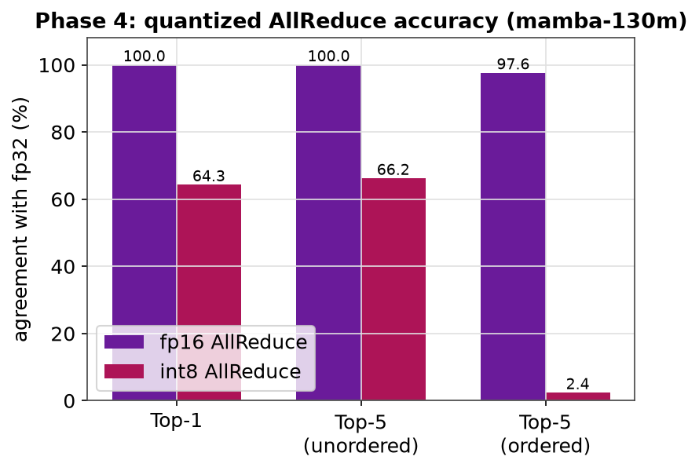
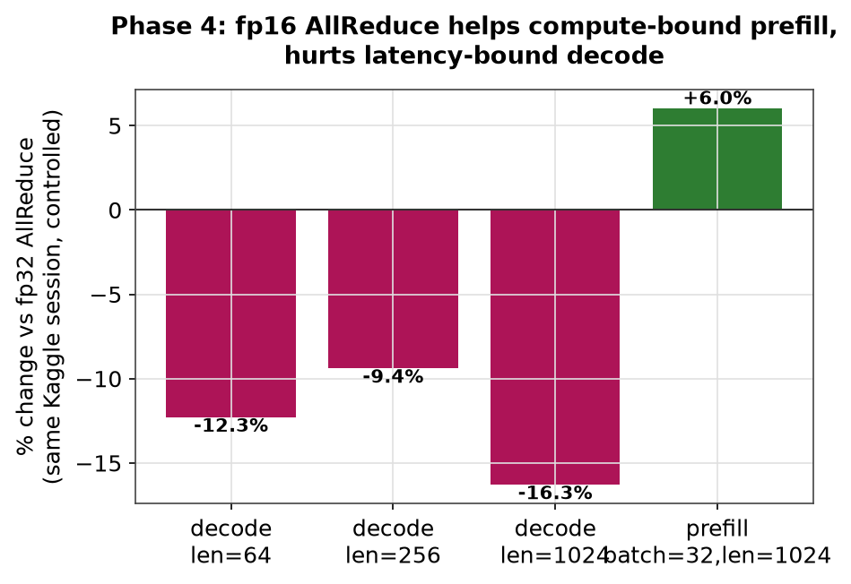

# Mamba-TP Lite

Tensor-parallel inference for the Mamba state-space model, implemented from
scratch in PyTorch: a Mamba forward pass verified against Hugging Face's
reference implementation, channel-sharded tensor parallelism with exactly 2
AllReduces per block, quantized communication (FP16/INT8), and CUDA
graph-captured decode. Benchmarked on real 2xT4 GPUs (Kaggle).

## Results

**CUDA graph decode: 2.5–3.7x faster, verified bit-exact against eager execution**


**Tensor parallelism: ~1.7–1.8x prefill throughput once batch size saturates a single GPU's compute**


Single-token decode is a different story — communication overhead dominates at low batch and tensor parallelism is slower than one GPU:


**SSM cache: decode cost stays flat regardless of prompt length (up to 73x faster than recomputing the prefix from scratch)**


**Quantized AllReduce: FP16 is near-lossless, INT8 trades accuracy for bandwidth**




Full numbers: [`benchmarks/PHASE3_RESULTS.md`](benchmarks/PHASE3_RESULTS.md), [`benchmarks/PHASE4_RESULTS.md`](benchmarks/PHASE4_RESULTS.md), [`benchmarks/PHASE5_RESULTS.md`](benchmarks/PHASE5_RESULTS.md). Regenerate charts with `.venv/bin/python scripts/make_plots.py`.

## Components

| | File | |
|---|---|---|
| Model | [`mamba_lite/model.py`](mamba_lite/model.py) | Mamba forward pass: `prefill()` for the full scan, `step()` for cached recurrent decode. |
| Tensor parallelism | [`mamba_lite/tp_model.py`](mamba_lite/tp_model.py) | Channel-sharded mixer, exactly 2 AllReduces per block. Includes a deliberately incorrect `NaiveTPMambaMixer` used in tests to catch a packed-tensor sharding bug. |
| Benchmark/profiling | [`scripts/run_tp.py`](scripts/run_tp.py) | `torchrun`-launched throughput and `torch.profiler` harness. |
| Quantized communication | [`mamba_lite/tp_utils.py`](mamba_lite/tp_utils.py) | FP16/INT8 AllReduce with an accuracy check (Top-1/Top-5 agreement). |
| CUDA graphs | [`mamba_lite/cuda_graph.py`](mamba_lite/cuda_graph.py) | Graph-captured decode with a numerical correctness check run before any speedup is reported. |

## Setup

```bash
python3 -m venv .venv
.venv/bin/pip install -e .
.venv/bin/pip install torch transformers safetensors huggingface_hub pytest
```

## Tests (all run on CPU, no GPU needed)

```bash
.venv/bin/python -m pytest tests/ -v
```

- `test_correctness.py` — Mamba forward pass vs. Hugging Face's `MambaForCausalLM`.
- `test_tp_correctness.py` — 2-process (`gloo`) tensor-parallel correctness, AllReduce count, and the naive-sharding failure case.
- `test_tp_lm_correctness.py` — same, for the full stacked model.
- `test_quantized_allreduce.py` — quantized AllReduce correctness and the accuracy table above.

## Benchmarks

```bash
# SSM cache: decode latency, cached vs. no cache (CPU is fine)
.venv/bin/python benchmarks/bench_cache.py --prompt-lens 16 64 256

# Tensor-parallel throughput, profiler trace, quantized AllReduce
torchrun --standalone --nproc_per_node=2 scripts/run_tp.py --backend gloo --device cpu   # local smoke test
torchrun --standalone --nproc_per_node=2 scripts/run_tp.py --backend nccl --device cuda \
  --compare-single-gpu --profile --allreduce-dtype fp16   # real 2-GPU box (e.g. Kaggle "GPU T4 x2")

# CUDA graph decode speedup, verified correct, same-session A/B (needs a real GPU)
torchrun --standalone --nproc_per_node=2 scripts/run_tp.py --backend nccl --device cuda \
  --compare-single-gpu --verify-cuda-graph --compare-cuda-graph
```

## Reference

Sharding and communication design follows ["Scaling State-Space Models on Multiple GPUs with Tensor Parallelism"](https://arxiv.org/abs/2602.21144) (Dutt, Shah, Masarani, Gandhi — Stony Brook University).
