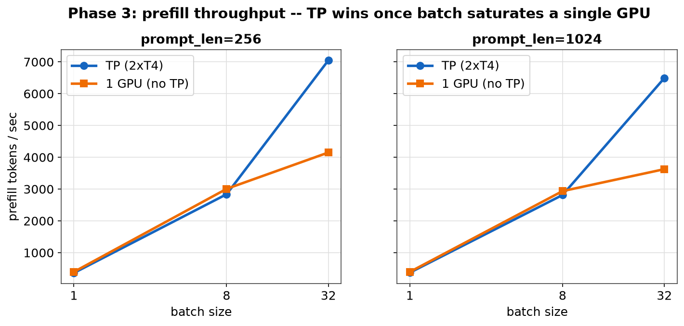
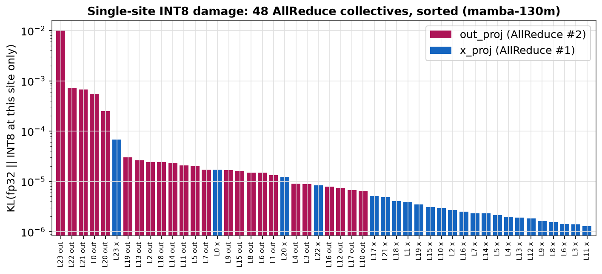
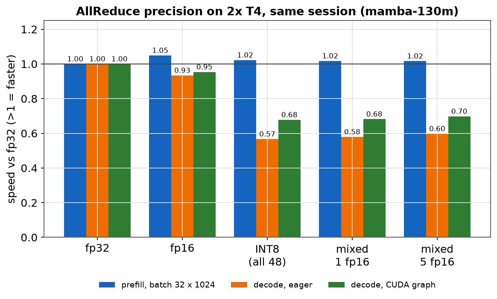

# Mamba-TP Lite

Tensor-parallel inference for the Mamba state-space model, implemented from
scratch in PyTorch: a Mamba forward pass verified against Hugging Face's
reference implementation, an SSM state cache, channel-sharded tensor
parallelism with exactly 2 AllReduces per block, CUDA graph-captured decode,
and quantized (FP16/INT8, per-collective) communication. Benchmarked on real
2x T4 GPUs (Kaggle).

Each section below lists the **main results** first, then **observations**:
findings that are worth knowing but are expected behavior or known
techniques, not contributions.

| Area | Main result |
|---|---|
| Correctness | Matches Hugging Face `MambaForCausalLM` (logits and greedy tokens); TP output matches the dense model exactly |
| SSM cache | Decode cost flat in prompt length; 39-73x faster than recomputing the prefix (CPU) |
| Tensor parallelism | Exactly 2 AllReduces/block; **1.7-1.8x prefill throughput** at batch 32 on 2x T4 |
| CUDA graphs | **2.5-3.7x faster decode**, bit-exact against eager execution |
| Quantized communication | 43 of 48 collectives in INT8 at KL 0.0005 vs fp32 (Top-1 98.8%), 70% less communication volume; no speedup on this hardware |

## Mamba implementation and SSM cache

**Main results**

- `prefill()` runs the full selective scan; `step()` runs the cached recurrent update (per-layer SSM state plus conv history).
- Logits match `MambaForCausalLM` (`allclose`), greedy tokens are identical, and cached decode reproduces the full-prefill logits at every position.
- Decode stays flat at about 12 ms/token regardless of prompt length. Without the cache, each token rescans the prefix: **39x (16-token prompt) to 73x (256-token prompt) slower** (CPU).


**Observations**

- The SSM state is O(1) in sequence length, unlike a transformer's KV cache. That is a property of the architecture, not of this implementation.

## Tensor parallelism

**Main results**

- Channel-sharded mixer: `in_proj` is split per half (`[x | z]` separately), the conv, scan and gate shard by channel with no communication, and `x_proj` and `out_proj` are row-parallel. That is **exactly 2 AllReduces per block**, asserted in tests by a collective counter.
- Output matches the dense model exactly. The cache is sharded by channel too, and checkpoints are sliced per rank on load, so no rank materializes the full model.
- **Prefill throughput on 2x T4 (batch 32): 1.70x (256 tokens) and 1.79x (1024 tokens)** of a single GPU, once the batch saturates one GPU's compute.



**Observations**

- At small batch sizes (1-8) prefill is slightly slower than one GPU (0.91-0.96x). The crossover to a gain is where a single GPU becomes compute-bound.
- Single-token decode is **slower** with TP (0.73-0.77x of one GPU on mamba-130m, 0.75x on mamba-1.4b). Each token pays 48 blocking AllReduces (2 x 24 layers), a count independent of batch size and model size, and AllReduce is 89% of rank-0 GPU time in the profile. Over PCIe this is expected.
- A naive contiguous split of the packed `in_proj` output gives wrong results. The repo includes that variant (`NaiveTPMambaMixer`) so a test can confirm it fails.


## CUDA graph decode

**Main results**

- The whole decode step (all layers, and for TP all 48 AllReduces) is captured once and replayed per token.
- **2.5-3.7x decode speedup**, for both TP and single GPU, across 64/256/1024-token prompts. Graphed output is **bit-exact** against eager (`detail=0.0`); a numerical check against eager runs before any speedup is reported.


**Observations**

- Decode is launch-bound: the speedup comes from removing per-kernel launch overhead, not from less work.
- Replay reuses fixed memory addresses, so cache state must be updated in place (`.copy_()`), not by rebinding a Python attribute.
- A later session measured 5.7x for fp32 TP decode (25.1 to 4.4 ms) with the same eager baseline. Shared-GPU variance between sessions is large, so only same-session ratios are compared in this repo.

## Quantized communication

The AllReduce payload can be cast down before the collective. FP16 and INT8 are selectable per collective, so each of the 48 sites (24 layers x `x_proj`/`out_proj`) can use a different precision. Accuracy is measured as KL(fp32 || quantized), Top-1 and Top-5 agreement against the fp32 TP logits on 64-100 Simple English Wikipedia passages of 256 tokens (`mamba-130m`).

**Main results**

- **FP16** is near-lossless: KL 0.00001, Top-1 99.9%, Top-5 (ordered) 97.5%, half the bytes on the wire.
- **INT8** is implemented as an all-gather of int8 values plus per-token scales, summed locally. int8 is really on the wire (**673 MB vs 2668 MB per prefill forward**) and it needs one collective per site with no GPU-to-CPU sync, so it can be CUDA-graph captured (verified exact on 2x T4). With all 48 sites in INT8: KL 0.013, Top-1 92.9%.

| INT8 variant (all 48 sites) | KL | Top-1 | Top-5 ordered |
|---|---|---|---|
| one scale per tensor | 0.65 | 67.5% | 3.6% |
| **one scale per token** | **0.013** | **92.9%** | **36.8%** |

- **Per-site sensitivity:** one collective, layer 23's `out_proj`, accounts for about 80% of the all-INT8 damage (single-site KL 0.0101 of 0.0127). `out_proj` sites are about 75x more sensitive than `x_proj` sites on average.
- **Mixed precision:** keeping the 5 most sensitive `out_proj` sites (layers 23, 22, 21, 20, 0) in FP16 and the other 43 in INT8 gives **KL 0.0005, Top-1 98.8%, Top-5 ordered 80.2%**, with 70% less communication volume than fp32 (798 vs 2668 MB). Combinations were measured directly, via a Pareto curve and a greedy search.




**Speed (2x T4, same session, fp32 = 1.00x)**

| config | prefill (batch 32 x 1024) | decode, eager | decode, CUDA graph |
|---|---|---|---|
| fp16 | 1.05x | 0.93x | 0.95x |
| INT8, all 48 | 1.02x | 0.57x | 0.68x |
| mixed (43 INT8 + 5 FP16) | 1.02x | 0.60x | 0.70x |

Quantized communication is **accurate but not faster here**: INT8 and mixed prefill are within round-to-round noise (about +/-5%), decode is 30-43% slower, and FP16 gives a small prefill gain (+3% to +7% in each of 3 rounds) at a small decode cost.



**Observations**

- The INT8 error is mostly scale granularity, not the 8 bits: one scale per tensor is set by outliers. Per-token scaling is a standard technique; here it cut KL about 50x.
- An earlier INT8 version summed `int32` and so saved no bandwidth; it was replaced by the int8 all-gather above.
- INT8 decode is slower because each collective runs about a dozen small quantize/pack/dequantize kernels (about 43 us per site, against about 4 us for FP16's cast pair). FP16's decode cost is the cast kernels' runtime, so graph capture only shrinks it.
- Communication is a small share of a batch-32 prefill at this model size (about 5-9% by estimate, not profiled), which limits what any payload reduction can win.
- Accuracy results from an earlier 42-token check reproduced on 100 x 256-token passages.

Full numbers: [`benchmarks/tensor_parallel_results.md`](benchmarks/tensor_parallel_results.md), [`benchmarks/quantized_allreduce_initial_results.md`](benchmarks/quantized_allreduce_initial_results.md) (original FP16/INT8 study), [`benchmarks/cuda_graph_results.md`](benchmarks/cuda_graph_results.md), [`benchmarks/mixed_precision_results.md`](benchmarks/mixed_precision_results.md) (mixed precision, current INT8). Raw data is in [`benchmarks/quant_mixed/`](benchmarks/quant_mixed/). Regenerate charts with `.venv/bin/python scripts/make_plots.py`.

## Scope and limitations

- Measurements are on `mamba-130m` (and 1.4b for the TP decode/prefill comparison), on a PCIe-connected T4 pair with no NVLink. Larger models or faster interconnects would shift the communication findings.
- Speed numbers come from shared Kaggle GPUs; comparisons are same-session back-to-back, and differences under about 5% are within noise.
- Only the mixer is sharded. The embedding and `lm_head` are replicated on every rank, and everything runs in fp32 weights and activations apart from the communication payloads.

## Components

| | File | |
|---|---|---|
| Model | [`mamba_lite/model.py`](mamba_lite/model.py) | Mamba forward pass: `prefill()` for the full scan, `step()` for cached recurrent decode. |
| Tensor parallelism | [`mamba_lite/tp_model.py`](mamba_lite/tp_model.py) | Channel-sharded mixer, exactly 2 AllReduces per block, per-collective precision lookup. Includes a deliberately incorrect `NaiveTPMambaMixer` used in tests. |
| Quantized communication | [`mamba_lite/tp_utils.py`](mamba_lite/tp_utils.py) | FP16 and INT8 collectives (int8 all-gather with per-token scales), collective counter. |
| Accuracy evaluation | [`mamba_lite/quant_eval.py`](mamba_lite/quant_eval.py) | KL / Top-1 / Top-5 harness against the fp32 TP logits. |
| CUDA graphs | [`mamba_lite/cuda_graph.py`](mamba_lite/cuda_graph.py) | Graph-captured decode. |
| Benchmarks | [`scripts/run_tp.py`](scripts/run_tp.py), [`scripts/quant_gpu_bench.py`](scripts/quant_gpu_bench.py) | `torchrun` throughput and profiling harness; same-session precision comparison. |

## Setup

```bash
python3 -m venv .venv
.venv/bin/pip install -e .
.venv/bin/pip install torch transformers safetensors huggingface_hub pytest pyarrow matplotlib
```

## Tests (all run on CPU, no GPU needed; about 10 minutes)

```bash
.venv/bin/python -m pytest tests/ -v
```

- `test_correctness.py`: Mamba forward pass vs. Hugging Face's `MambaForCausalLM`.
- `test_tp_correctness.py`: 2-process (`gloo`) tensor-parallel correctness, AllReduce count, and the naive-sharding failure case.
- `test_tp_lm_correctness.py`: same, for the full stacked model.
- `test_quantized_allreduce.py`: quantized AllReduce correctness and a Top-1/Top-5 accuracy table.
- `test_per_site_allreduce.py`: per-collective precision lookup, collective counts, and the INT8 variants.

## Benchmarks

```bash
# SSM cache: decode latency, cached vs. no cache (CPU is fine)
.venv/bin/python benchmarks/bench_cache.py --prompt-lens 16 64 256

# Tensor-parallel throughput and profiler trace
torchrun --standalone --nproc_per_node=2 scripts/run_tp.py --backend gloo --device cpu   # local smoke test
torchrun --standalone --nproc_per_node=2 scripts/run_tp.py --backend nccl --device cuda \
  --compare-single-gpu --profile                                                          # real 2-GPU box

# CUDA graph decode speedup, verified correct, same-session A/B (needs a real GPU)
torchrun --standalone --nproc_per_node=2 scripts/run_tp.py --backend nccl --device cuda \
  --compare-single-gpu --verify-cuda-graph --compare-cuda-graph

# Quantization accuracy (CPU): global, per-site sweep, mixed-precision search
.venv/bin/python scripts/quant_eval_global.py --n 100 --len 256
.venv/bin/python scripts/quant_site_sweep.py --dtype int8
.venv/bin/python scripts/quant_mixed_search.py

# Precision comparison: fp32 / fp16 / INT8 / mixed, same session (2 GPUs)
torchrun --standalone --nproc_per_node=2 scripts/quant_gpu_bench.py
```

## Reference

Sharding and communication design follows ["Scaling State-Space Models on Multiple GPUs with Tensor Parallelism"](https://arxiv.org/abs/2602.21144) (Dutt, Shah, Masarani, Gandhi, Stony Brook University).
